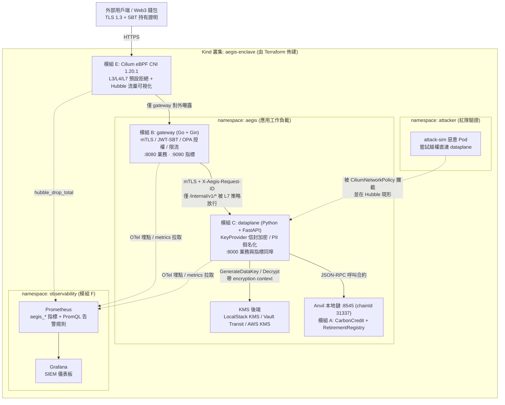

# Aegis-Enclave

**雲端原生零信任金融合約與可觀測性安全閘道**

     

---

## 這個專案在解決什麼問題

金融與 ESG 領域的雲端系統普遍存在一個結構性缺口：**邊界驗證（誰可以進來）與資料保護（資料怎麼被保護）被混在同一層實作，而且兩者都缺乏可稽核的證據**。結果是憑證一旦洩漏，攻擊者就能在網路內橫向移動並直接讀取明文 PII；即使事後追查，日誌裡又因為塞滿原始個資而無法安全地交給第三方分析。Aegis-Enclave 用一套可在筆電上完整跑起來的叢集回答這個問題：把 authN/authZ 收斂到 Go 閘道、把加解密與去識別化收斂到 Python 資料面、用 Cilium eBPF 的預設拒絕微分段強制兩者之間只有一條合法路徑，並讓每一次金鑰操作、每一次策略攔截都變成 Prometheus 指標與結構化稽核日誌 —— 也就是說，**安全控制項不只被宣稱，而是被持續量測**。碳權退役合約則作為「高價值金融資產」的具體標的，驗證這套防護在真實業務流程上成立。

---

## 架構



設計上刻意讓 **gateway 完全不持有任何金鑰材料**，而 **dataplane 完全不對外曝露**。任一側被攻破都無法單獨取得明文資料，這是縱深防禦落到部署拓撲上的具體形式。

---

## 九個模組：職責、賽事與 CCSP Domain 對照

契約第 8 節的路徑所有權對應九塊已落地的範圍（A–G + CI + 骨架）。狀態以倉庫現況為準，不是骨架。

| 模組 | 路徑 | 核心職責 | 對應賽事 | CCSP Domain | 狀態 |
| --- | --- | --- | --- | --- | --- |
| **A 合約** | `contracts/` | ERC-1155 碳權批次代幣 `CarbonCredit.sol` 與 `RetirementRegistry.sol`（退役防雙花）。Foundry unit / fuzz / invariant 測試 + `forge coverage`，Slither 產 SARIF 上傳 GitHub Code Scanning | IEEE ClimateChain | **D4** 雲端應用程式安全 | 已落地 |
| **B 閘道** | `services/gateway/` | Go + Gin。middleware 鏈：mTLS 驗證 → JWT/SBT 持有證明 → OPA/Rego 授權決策 → 每 subject 限流 → OTel 指標。多階段建置為 distroless 非 root 映像 | TLN、ForgeHacks | **D5** 雲端安全營運 | 已落地 |
| **C 資料面** | `services/dataplane/` | Python + FastAPI。可插拔 `KeyProvider` 介面搭配信封加密（KMS 產 DEK、本地 AES-256-GCM 加密資料、只落地加密後的 DEK），以及 HMAC-SHA256 決定論 PII tokenization | Financial Cybersecurity Challenge | **D2** 雲端資料安全 | 已落地 |
| **D 基礎設施** | `infra/terraform/` | `tehcyx/kind` provider 一鍵拉起 `disableDefaultCNI` 叢集（pin `node_image`），helm provider 安裝 Cilium 與 kube-prometheus-stack，輸出 kubeconfig | HackTitan | **D3** 雲端平台與基礎設施安全 | 已落地 |
| **E 網路策略** | `infra/k8s/` | 預設全拒絕的 `CiliumNetworkPolicy` 逐條開放；L7 規則限制 gateway 只能打 dataplane 的特定 method + path。`scripts/attack-sim/` 起惡意 Pod 實證攔截 | HackTitan、ForgeHacks | **D3** 雲端平台與基礎設施安全 | 已落地 |
| **F 可觀測性** | `infra/observability/` | PrometheusRule / ServiceMonitor / Grafana SIEM 儀表板。告警涵蓋異常解密速率（資料外洩）、遮罩失效、微分段阻擋 | Financial Cybersecurity、TLN | **D5** 雲端安全營運 | 已落地 |
| **G 文件與敘事** | `docs/`、`scripts/demo-*.sh` | STRIDE 威脅建模、CCSP 控制項對照表、ADR、五份賽事專屬 demo 腳本 | TLN、全賽事評審材料 | **D1–D5** 治理與稽核 | 已落地 |
| **CI** | `.github/workflows/` | 五條必過閘門：`contracts`、`gateway-go`、`dataplane-py`、`iac`、`e2e-kind` | 全賽事供應鏈 | **D5** 雲端安全營運 | 已落地 |
| **骨架** | `Makefile`、`scripts/bootstrap.sh`、`scripts/doctor.sh` | 唯一操作入口：工具鏈安裝、環境健檢、映像／叢集／測試／掃描 | 全賽事 | **D1** 治理與可重現操作 | 已落地 |

> **一魚多吃的關鍵**不是共用程式碼，而是把差異化收斂到 demo 敘事層：應用與叢集共用同一座 Kind，每場比賽只更換 `scripts/demo-<賽事>.sh` 與 `docs/demo/<賽事>.md`。程式碼零重寫，評審看到的故事完全不同。
>
> 跨模組介面仍以 [`docs/CONTRACT.md`](docs/CONTRACT.md) 為準；九個模組的實作已依契約落地。

---

## 快速開始

**前置需求**：macOS 或 Linux、Homebrew、Docker Desktop（建議配置 4 核 CPU 與 8 GB 記憶體以上）、Go 1.23 以上、Python 3.12 以上。

先確認工具鏈，**不要先自動執行 `make up`**——它會建立 Kind 叢集並跑 `terraform apply`。

```bash
make bootstrap    # 安裝缺少的工具鏈（kind / helm / cilium / hubble / terraform / foundry / uv）
make doctor       # 檢查本機是否具備執行條件，並提示 macOS 的 eBPF 限制
```

`make bootstrap` 是 idempotent 的，重複執行只會略過已安裝的工具。Trivy 與 Slither 刻意不裝在本機，而是透過官方 Docker 映像執行，好處是掃描器版本與 CI 完全一致，也不會在開發機累積 Python 相依衝突。

`make doctor` 通過後，再依需要拉起叢集。**先有 JWKS，再 deploy**：Kind/demo 的驗簽公鑰由 [`infra/k8s/base/jwks.demo.yaml`](infra/k8s/base/jwks.demo.yaml) 提供（**僅供 Kind/demo，非正式金鑰**），`kubectl apply -k infra/k8s/base` 會一併建立。沒有 `aegis-gateway-jwks` 時 gateway `/readyz` 回 503，`make deploy` 會等滿 180s。正式金鑰請自行建立，不可提交。

```bash
# 自行決定時機：建置映像 → terraform apply 拉起叢集 → 部署應用與網路策略
make up

# 若叢集已在：確認 JWKS 後再部署（demo Secret 已含在 kustomize base）
make deploy

# 模組 F：Prometheus 規則、ServiceMonitor、Grafana 儀表板
# （需要模組 D 已裝好 kube-prometheus-stack）
kubectl apply -k infra/observability

make demo-tln     # 執行 TLN 賽事的展示流程（零信任攔截 + SIEM 日誌審計）
```

正式環境覆蓋 JWKS：

```bash
kubectl -n aegis create secret generic aegis-gateway-jwks \
  --from-file=jwks.json=path/to/jwks.json
```

細節見 [`infra/k8s/README.md`](infra/k8s/README.md) 與 [`infra/observability/README.md`](infra/observability/README.md)。

**其他常用指令**（完整清單執行 `make help`）：

| 指令 | 用途 |
| --- | --- |
| `make test` | 跑三個語言的全部測試（forge / go test -race / pytest） |
| `make scan` | Trivy 掃映像與 IaC 錯誤組態 + Slither 靜態分析合約 |
| `make hubble` | 開啟 Hubble 觀察即時流量與策略攔截 |
| `make grafana` | 連接埠轉發 Grafana，檢視 SIEM 儀表板 |
| `make down` | 銷毀整座叢集 |

五場賽事各有獨立入口：`demo-tln`、`demo-fincyber`、`demo-forgehacks`、`demo-climatechain`、`demo-hacktitan`。

### 用 gh 建立 remote 與 branch protection

下列指令只寫在文件裡，**不要自動執行**。有 GitHub 帳號與 `gh auth login` 之後再自行跑。

```bash
# 1. 以目前目錄建立 GitHub repo，設定 origin，並推送既有 commit
gh repo create Aegis-Enclave --private --source=. --remote=origin --push

# 2. 鎖定 default branch 的保護規則：五條 CI 必過、至少 1 位審查、禁止 force push
OWNER_REPO="$(gh repo view --json nameWithOwner -q .nameWithOwner)"
DEFAULT_BRANCH="$(gh repo view --json defaultBranchRef -q .defaultBranchRef.name)"

gh api --method PUT \
  -H "Accept: application/vnd.github+json" \
  -H "X-GitHub-Api-Version: 2022-11-28" \
  "repos/${OWNER_REPO}/branches/${DEFAULT_BRANCH}/protection" \
  --input - <<'EOF'
{
  "required_status_checks": {
    "strict": true,
    "contexts": [
      "contracts",
      "gateway-go",
      "dataplane-py",
      "iac",
      "e2e-kind"
    ]
  },
  "enforce_admins": true,
  "required_pull_request_reviews": {
    "required_approving_review_count": 1,
    "dismiss_stale_reviews": true,
    "require_code_owner_reviews": true
  },
  "restrictions": null,
  "allow_force_pushes": false,
  "allow_deletions": false,
  "required_linear_history": true,
  "required_conversation_resolution": true
}
EOF
```

---

## 安全設計摘要

### 零信任：不因為在網路內就被信任

沒有任何請求因為來源網段而獲得信任。gateway 的 middleware 鏈依序驗證用戶端憑證（mTLS）、JWT/SBT 持有證明、OPA/Rego 授權決策，再套用每 subject 的速率限制。健康探針（`/healthz`、`/readyz`）是唯一免驗證的端點，因為 kubelet 無法攜帶用戶端憑證。服務間呼叫同樣走 mTLS，並強制帶上 `X-Aegis-Request-ID` 以串接分散式追蹤 —— 每一個授權決策都可以被追回到單一請求。

### 信封加密：金鑰用途綁定，且不必為每筆資料打 KMS

dataplane 向 KMS 索取資料金鑰（DEK），用 AES-256-GCM 在本地加密資料，只把**加密後的 DEK** 與密文一起落地（格式見契約第 6 節）。關鍵細節是 `aad` 欄位同時作為 AES-GCM 的 additional authenticated data 與 KMS encryption context，**兩者必須完全一致**：這讓密文與其用途（`record_id` / `tenant` / `purpose`）在密碼學上綁定，把 DEK 搬到別的情境解密會直接失敗。`KeyProvider` 介面有 LocalStack KMS、Vault Transit、AWS KMS 三個 driver，跑同一組合約測試（contract test）以確保行為一致。

### 預設拒絕微分段：策略必須被證明有效，而非寫在 YAML 裡就算

Cilium 以 default-deny 起步，再逐條開放必要路徑。L7 HTTP 規則只放行 `/internal/v1/*` 與 `/internal/healthz`；任何其他路徑（例如 `/internal/v1/keys` 或 FastAPI 自動產生的 `/docs`）一律拒絕。為了不讓這件事停留在宣稱層面，`scripts/attack-sim/` 會在 `attacker` namespace 起一個惡意 Pod 嘗試直連 dataplane，並用 Hubble 佐證攔截事件；CI 的 `e2e-kind` workflow 在 GitHub runner 上實跑同一套驗證並斷言連線被拒。

### 日誌假名化：可分析，但不可反推

稽核日誌是結構化 JSON（格式見契約第 4 節），其中 `subject` 一律是 `sub_` 加上 HMAC-SHA256 前 16 碼十六進位的假名，HMAC 金鑰由 KMS 保管。因為是決定論 tokenization，同一筆 PII 永遠產生同一 token，日誌仍可 join 分析；但沒有金鑰就無法反推原值。日誌與 Prometheus 標籤中**禁止出現原始 PII、金鑰材料或完整 JWT**，這同時滿足 ESG 資料與稽核日誌的匿名化要求，也是對齊 GDPR / PCI DSS 的最短路徑。

### 供應鏈與組態

映像為多階段建置的 distroless 非 root；Trivy 對映像與 IaC 的 HIGH/CRITICAL 發現視為建置失敗；Slither 結果以 SARIF 上傳 GitHub Code Scanning；Dependabot 每週追蹤六個 ecosystem 的相依更新。

---

## 專案結構

```
Aegis-Enclave/
├── Makefile                          # 唯一操作入口：make up / test / scan / demo-<賽事>
├── .env.example                      # 環境變數範本，對齊 docs/CONTRACT.md 第 5 節
├── .editorconfig                     # 跨語言縮排規範（Go tab / Python 4 / YAML 2）
├── .dockerignore                     # 以 repo 根目錄為 build context 時的排除清單
├── .github/
│   ├── workflows/                    # contracts / gateway-go / dataplane-py / iac / e2e-kind
│   ├── CODEOWNERS                    # 依模組劃分審查責任
│   ├── PULL_REQUEST_TEMPLATE.md      # 含安全檢查清單
│   └── dependabot.yml                # 六個 ecosystem 每週更新
├── contracts/                        # 模組 A：Solidity + Foundry + Slither
│   └── src/  test/  script/
├── services/
│   ├── gateway/                      # 模組 B：Go + Gin 零信任閘道
│   │   ├── cmd/gateway/
│   │   └── internal/{config,middleware,observability,policy}/
│   └── dataplane/                    # 模組 C：Python + FastAPI 資料安全服務
│       ├── app/{api,chain,kms,masking}/
│       └── tests/
├── infra/
│   ├── terraform/                    # 模組 D：Kind 叢集 + Helm releases
│   │   └── modules/{kind-cluster,cilium,observability}/
│   ├── k8s/                          # 模組 E：Kustomize base + CiliumNetworkPolicy
│   │   └── base/  policies/          # base 含 jwks.demo.yaml（僅供 Kind/demo）
│   └── observability/                # 模組 F：kubectl apply -k infra/observability
│       ├── kustomization.yaml
│       ├── prometheus/{rules,servicemonitors}/
│       └── grafana/dashboards/
├── scripts/
│   ├── bootstrap.sh                  # 安裝工具鏈（idempotent）
│   ├── doctor.sh                     # 環境健檢，不做任何修改
│   ├── demo-*.sh                     # 五份賽事專屬展示腳本
│   └── attack-sim/                   # 越權連線模擬（驗證微分段真的有效）
└── docs/
    ├── CONTRACT.md                   # 跨模組介面契約：所有命名的唯一真實來源
    ├── adr/                          # 架構決策紀錄（含 macOS eBPF 限制）
    └── demo/                         # 各賽事的評審導覽說明
```

---

## 跨模組介面契約

九個模組由不同人平行開發，唯一的協調機制是 [`docs/CONTRACT.md`](docs/CONTRACT.md) —— 它定義了版本號、服務端點與埠、Prometheus 指標名稱與標籤、稽核日誌欄位、環境變數、密文信封格式、合約 ABI，以及**路徑所有權**。只要所有人遵守契約就不需要互相等待；反過來說，修改契約前必須先確認不會破壞其他模組。所有自訂指標一律以 `aegis_` 為前綴，服務端不得擅自更名，因為模組 F 的告警規則與儀表板直接依賴這些名稱。

---

## 已知限制

- **macOS + Docker Desktop 的 eBPF 限制（最大風險）**：Cilium 的 `kubeProxyReplacement` 與 Socket LB 需要特定 cgroup namespace 條件，在 Docker Desktop 的 Linux VM 中通常無法滿足。因此預設組態關閉 KPR，此模式下 NetworkPolicy 與 Hubble 仍完整可用（demo 所需的功能都在）；KPR 設為 Terraform 的 opt-in 變數，若需要完整 eBPF 資料面則改用 Lima/Colima VM。決策脈絡與替代方案見 [`docs/adr/`](docs/adr/)（`0002-ebpf-on-macos.md`），`make doctor` 也會在 macOS 上主動提示。
- **`tehcyx/kind` provider 落後上游**：provider 目前支援到 kind 0.31，上游已是 0.33。因此 `kind_cluster` 明確 pin `node_image` 為 `kindest/node:v1.31.0`，不依賴 provider 預設值。
- **LocalStack KMS 不等於生產級 KMS**：預設 driver 為 LocalStack，目的是讓整套流程完全免費且可離線 demo，但它不是 FIPS 140 驗證的 HSM，也不提供真實的金鑰輪替稽核軌跡。生產情境應切換 `AEGIS_KMS_DRIVER=aws` 或 `vault`。
- **鏈上部分僅限本地**：合約部署在 Anvil（chainId 31337），沒有測試網或主網部署；因此 gas 成本與 MEV 相關的攻擊面不在本專案的驗證範圍內。
- **本機叢集是手動步驟**：九個模組已落地，但 `make up` 會建立 Kind 叢集並跑 Terraform，請先 `make bootstrap` → `make doctor`，確認後再自行執行。部署前須有 JWKS（demo 已內建；正式金鑰不可提交），應用起來後再 `kubectl apply -k infra/observability`。

---

## 授權與貢獻

本專案為黑客松參賽作品。提交 PR 前請先執行 `make fmt` 與 `make test`，並完整填寫 PR 模板中的安全檢查清單（是否新增機密、是否影響網路策略、是否更動 KMS 流程、是否需要更新威脅模型）。所有文件與程式碼註解一律使用繁體中文。
